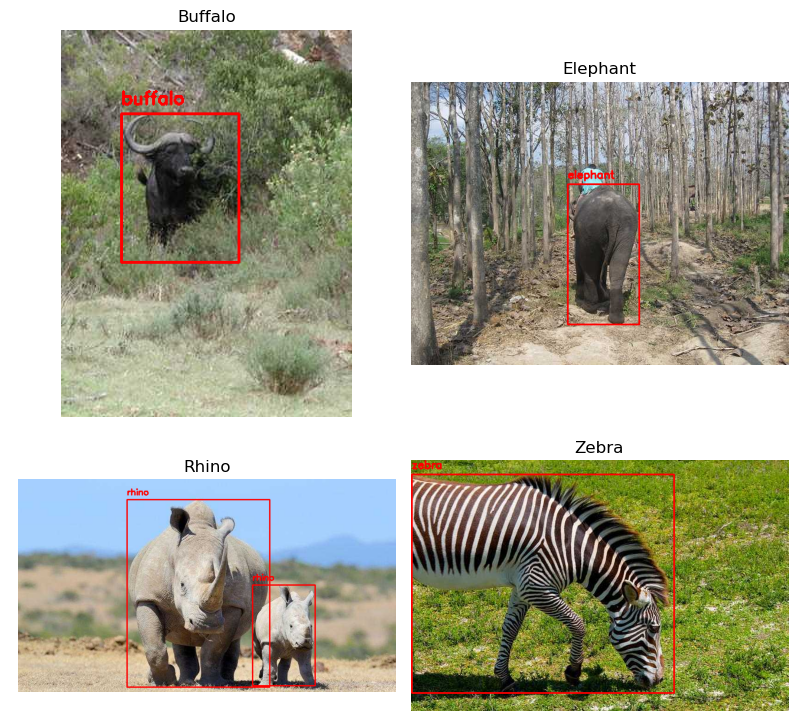

# Wildlife Detection with Deep Learning (YOLOv8)
This repository contains a deep learning project focused on object detection for identifying four species of African wildlife—buffalo, elephant, rhino, and zebra, using the YOLOv8 model. The objective is to train and evaluate different model variants to achieve accurate and efficient detection.




📜 Project Description
This project explores the use of convolutional neural networks, specifically the YOLOv8 architecture, for object detection in wildlife imagery. Several versions of the model (YOLOv8n, YOLOv8s) are trained and compared, and the impact of data augmentation techniques, such as brightness adjustment and horizontal flipping, is investigated to improve model performance.

The full project report, which details the data preprocessing, model architecture, training, and evaluation of results, can be found at the link below:

  📄 **[Read full report of the proyect (PDF)](Wildlife%20Detection%20using%20Deep%20Learning.pdf)**

🛠️ Technologies Used
Python 3.9

- Ultralytics YOLOv8: The primary framework for model training and inference.

- PyTorch: The deep learning backend used by YOLOv8.

- OpenCV: For image preprocessing and data augmentation.

- Scikit-learn: For generating evaluation metrics like the confusion matrix and classification report.

- Pandas & NumPy: For data manipulation and numerical operations.

- Matplotlib & Seaborn: For data and results visualization.

- Jupyter Notebook: For interactive data exploration and experimentation.

⚙️ Installation and Usage
To run this project on your local machine, please follow these steps:

1. Clone the repository:

  ```bash
git clone https://github.com/your-username/Wildlife_detection_DL.git
cd your-repository-name
```

2. Create a virtual environment (recommended):

  ```bash
python -m venv venv
source venv/bin/activate  # On Windows, use: venv\Scripts\activate
```

3. Install the dependencies: All the necessary libraries are listed in the requirements.txt file.

  ```bash
pip install -r requirements.txt
```

🗂️ Repository Structure
- Wildlife Detection using Deep Learning.pdf: The detailed project report.

- Data_Exploration.ipynb: Notebook for exploring and visualizing the dataset.

- Data_Augmentation.ipynb: Notebook that implements the data augmentation techniques.

- Model_Training.ipynb: The main notebook for training and evaluating the YOLOv8 models and visualizing the results.

- requirements.txt: A list of the required Python dependencies.

- .gitignore: A file to ignore unnecessary files and directories.
